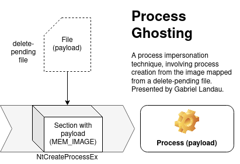

Process Ghosting
==========

This is my implementation of the technique presented by [Gabriel Landau](https://twitter.com/GabrielLandau): 
https://www.elastic.co/blog/process-ghosting-a-new-executable-image-tampering-attack

Characteristics:
-
+ Memory artifacts as in [Process Doppelgänging](https://github.com/hasherezade/process_doppelganging)
+ Payload mapped as `MEM_IMAGE` (unnamed: not linked to any file)
+ Sections mapped with original access rights (no `RWX`)
+ Payload connected to PEB as the main module
+ Remote injection supported (but only into a newly created process)
+ Process is created from an unnamed module (`GetProcessImageFileName` returns empty string)

<b>WARNING:</b>  
The 32bit version works on 32bit system only. 
